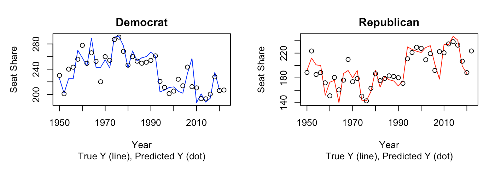

# 2022 Midterm Election Results

Republicans were able to take control of the House of Representatives by winning 222 seats - 4 more than they needed for the majority at 218. Democrats only won 213 seats, therefore losing the majority.

# My Model

My model took four variables: 1) the number of seats a party held before the given election, 2) whether the president’s party was Democrat or Republican, 3) the party’s lead or deficit on the generic ballot, and 4) GDP growth.

Through my model, I predicted that Democrats would win 207 seats and Republicans would win 223 seats in the House of Representatives; this number did not add up to 435 seats since I had two separate models for Democrat seat share and Republican seat share. My model was fairly accurate for the Republican seat share; I was off by 1 seat. If I had, instead of having two separate models, obtained the predicted Democrat seat share by subtracting the predicted Republican seat share from 435, I would've been close for the Democrat seat share as well (this new approach would have cause me to predict that the Democrats would win 212 seats).

The image below shows n in-sample fit, where I use already existing data and examine the r-squared values and compare the in-sample error. In other words, we are looking at how often a prediction on historical data matches the actual historical result. The r-squared values of my model were strong, at about 0.76. To compare the in-sample error, I graphed historical results versus predictions for my models, which can be seen below. The models for predicting both Democrat and Republican seat share are fairly accurate despite a few points.

Figure 1: my caption

# Improvements

My model was based only all election years, instead of soley midterm years. I wonder if I filter the data so that my prediction is based off of only midterm election years, would the prediction be more accurate? This is true especially since we have seen that the president's party does relatively poorly during midterm years. To test this hypothesis, I would redo the prediction of my final model while filtering out non-midterm years, and then compare the errors of that prediction to the one I already have.

Moreover, the main inspiration from my model came from the article “Will Democrats Catch a Wave? The Generic Ballot Model and the 2018 US House Elections” by Alan I. Abramowitz (2018). This article discusses how one model that took in only three variables resulted in variables with high significance (these variables being the number of seats a party held before the given election, whether the president’s party was Democrat or Republican, and the party’s lead or deficit on the generic ballot immediately after Labor Day). This may be an indication as to why my prediction was relatively accurate.

However, I hypothesize as to how improve my model. Gelman and King (1993) found that the closer it is to election day, the more accurate the polls are. I used polling data that was from polls conducted 52 days or less before election day. Perhaps I could decrease the number of days out from election day to get an even more accurate prediction, although the issue then becomes the lack of data and less polls in general. 

# References
Abramowitz, Alan I. "Will Democrats Catch a Wave? The Generic Ballot Model and the 2018 US House Elections." Cambridge University Press, 2018.
Gelman, Andrew and King, Gary. Why are American presidential election campaign polls so variable when votes are so predictable? British Journal of Political Science, 23(4): 409–451, 1993.
"Republicans Have Won the House, Regaining Control of the Chamber For the First Time Since 2018." Politico. https://www.politico.com/2022-election/results/house/.
